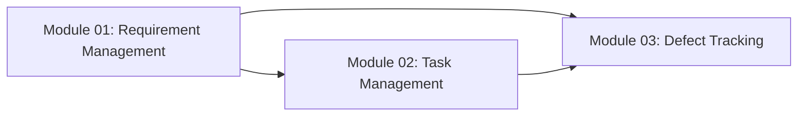

# Requirement Document — Module 01: Requirement Management

> **จัดทำโดย:** System Analyst (SA)
> **สถานะ:** Draft — รอ Review
> **Priority:** 🔴 MUST HAVE
> **ที่มา:** `aidlc/spaces/default/intents/260820-pm-tool-mvp/inception/requirements-analysis/requirements.md`, `docs/project-modules-overview.md`, `docs/team-roles-responsibilities.md`
> **ผู้อ่านเอกสารนี้:** SA, Dev, Tester (QA)
> **Scope:** express (Minimal depth) · **Stack:** React + Vite + TypeScript · **เก็บข้อมูล:** localStorage เท่านั้น

---


## 1. ภาพรวม (Overview)

### 1.1 วัตถุประสงค์

Module Requirement Management คือจุดเริ่มต้นของสายข้อมูลในระบบ:

```
Requirement → Task → Defect
```

โมดูลนี้ให้ผู้ใช้สร้าง Requirement ที่มีโครงสร้างชัดเจน แยกประเภท Functional/Non-Functional และจัดลำดับความสำคัญแบบ MoSCoW เพื่อให้สามารถผูก (trace) ต่อไปยัง Task และ Defect ได้ตลอดสาย

### 1.2 Pain Point ที่ต้องแก้

ทีมต้องการเครื่องมือที่ระบุได้ว่า **ต้นน้ำของปัญหาอยู่ที่ใคร** (สเปคไม่ครบ / design ไม่ครอบ / code ผิด / test ปล่อยผ่าน) แทนที่จะโยนให้ dev ทั้งหมด — โมดูล Requirement เป็นจุดเริ่มของสายนี้

### 1.3 ตำแหน่งของโมดูลในสายข้อมูล



Requirement เป็นจุดเริ่ม → ถูกแตกเป็น Task (Module 02) → เมื่อ Task มีปัญหาจะเกิด Defect (Module 03) ที่สามารถย้อนกลับมาถึง Requirement ต้นทางได้

**Text fallback:** Requirement Management → Task Management → Defect Tracking (Defect ย้อนกลับถึง Requirement ได้)

### 1.4 ขอบเขตของรอบนี้ (MVP)

เป้าหมายรอบนี้คือ **พิสูจน์โครงข้อมูลหลักบนหน้าจอ** — สร้าง Requirement ได้ เชื่อมโยงไป Task และ Defect ได้ ยังไม่ใช่ระบบสมบูรณ์

**สิ่งที่อยู่นอกขอบเขตรอบนี้ (Out of Scope):**
- NFR Metric validation (บังคับกรอกตัวเลขเมื่อเป็น Non-Functional)
- Status workflow (Draft → Approved → In Progress → Done)
- Module/Sprint assignment (ไม่มี entity Module และ Sprint ในระบบ)
- Dual Estimate (Initial vs Actual auto-rollup)
- Requirement ID แบบ sequential (REQ-001)
- Audit log / ประวัติการแก้ไข
- Role-based access control
- Backend / REST API / Database
- Authentication

---

## 2. ผู้ใช้งานและบทบาท (Actors)

| Role | บทบาทใน Module นี้ |
|------|---------------------|
| **ทุกคน** | สร้าง แก้ไข ลบ Requirement ได้ (ระบบไม่มีการจำกัดสิทธิ์) |
| **SA** | ผู้ที่ควรเป็นเจ้าของ Requirement โดยธรรมชาติของหน้าที่ |
| **PM** | ดูภาพรวมและใช้ Requirement เป็นฐานจัดการงาน |
| **Dev / Tester** | อ่านและอ้างอิง Requirement เมื่อทำงานใน Module อื่น |

> **หมายเหตุ:** รอบนี้ **ไม่มีระบบยืนยันตัวตนและไม่มีการจำกัดสิทธิ์** — ผู้ใช้เลือกชื่อจาก dropdown (12 คน hardcoded) และทุกคนทำได้ทุกอย่าง ดูความเสี่ยง R1 ใน requirements

---

## 3. Functional Requirements

### FR-01: สร้าง Requirement ผ่าน Web Form

**คำอธิบาย:** ผู้ใช้ต้องสามารถสร้าง Requirement ใหม่ผ่านฟอร์มบนเว็บ

**Field ของ Requirement:**

| Field | ประเภทข้อมูล | บังคับ | คำอธิบาย |
|-------|--------------|--------|----------|
| id | String (UUID, auto-generated) | ✅ (auto) | รหัสอ้างอิงภายใน สร้างอัตโนมัติ |
| Title | String | ✅ | หัวข้อสั้นของ Requirement |
| Description | Text | — | รายละเอียดความต้องการ |
| Category | Enum: `Functional` \| `Non-Functional` | ✅ | ประเภทของ Requirement (ดู FR-02) |
| Priority | Enum: `Must` \| `Should` \| `Could` \| `Won't` | ✅ | ค่าเริ่มต้น = `Should` (ดู FR-04) |
| Owner | Reference (User ID) | ✅ | ผู้รับผิดชอบ เลือกจาก dropdown |
| Created At | String (ISO date, auto) | ✅ (auto) | วันเวลาที่สร้าง |

**เกณฑ์การรับ (Acceptance Criteria):**

- Given ผู้ใช้กรอกฟอร์มครบทุก field บังคับและกดบันทึก, Then ระบบสร้าง Requirement ใหม่พร้อม UUID อัตโนมัติ และปรากฏในรายการทันที
- Given ผู้ใช้ยังไม่กรอก field บังคับ (หัวข้อ ประเภท), When กดบันทึก, Then ระบบแสดง error ระบุ field ที่ขาดและไม่บันทึกข้อมูล

**อ้างอิง:** requirements.md FR1.1

---

### FR-02: แยก Req Category — Functional / Non-Functional

**คำอธิบาย:** Requirement ทุกข้อต้องถูกจำแนกเป็นหนึ่งใน 2 ประเภท

| ประเภท | ความหมาย | ตัวอย่าง |
|--------|----------|----------|
| **Functional** | ความต้องการเชิงพฤติกรรม/ฟีเจอร์ของระบบ | "ผู้ใช้ต้องสามารถสร้าง Task ได้" |
| **Non-Functional** | ความต้องการเชิงคุณภาพ | "หน้าจอต้องโหลดเสร็จภายใน 2 วินาที" |

**เกณฑ์การรับ:**

- Given ผู้ใช้ไม่เลือก Category, When กดบันทึก, Then ระบบปฏิเสธพร้อมข้อความ "ต้องเลือกประเภทเป็น Functional หรือ Non-Functional"
- Given ผู้ใช้เลือก Category เป็นค่าใดค่าหนึ่ง, When บันทึก, Then ระบบเก็บค่าที่เลือกได้สำเร็จ

> **หมายเหตุ:** รอบนี้ยัง **ไม่มี** conditional fields สำหรับ NFR (เช่น NFR Type, Metric Value, Metric Unit) — เป็น out of scope ที่ควรกลับมาทำในรอบถัดไป

**อ้างอิง:** requirements.md FR1.2

---

### FR-03: MoSCoW Priority

**คำอธิบาย:** ทุก Requirement ต้องมีระดับความสำคัญตามหลัก MoSCoW

| ค่า | ความหมาย |
|-----|----------|
| `Must` | ต้องมีในเวอร์ชันนี้ ขาดไม่ได้ |
| `Should` | สำคัญ แต่พอยอมเลื่อนได้หากจำเป็น (⭐ ค่าเริ่มต้น) |
| `Could` | มีก็ดี ไม่มีก็ไม่กระทบ scope หลัก |
| `Won't` | ตกลงร่วมกันแล้วว่าจะไม่ทำในรอบนี้ |

**เกณฑ์การรับ:**

- Given ผู้ใช้สร้าง Requirement ใหม่โดยไม่แตะ Priority, When บันทึก, Then ค่าเริ่มต้นคือ `Should`
- Given ผู้ใช้เลือก Priority เป็นค่าอื่น, When บันทึก, Then ระบบเก็บค่าที่เลือก

**อ้างอิง:** requirements.md FR1.3

---

### FR-04: แสดงรายการและกรอง Requirement

**คำอธิบาย:** ระบบต้องแสดง Requirement ทั้งหมดในมุมมอง Board (จัดกลุ่มตาม MoSCoW priority) และ List view พร้อมให้กรองได้

**ตัวกรองที่มี:**

| ตัวกรอง | ค่าที่เลือกได้ |
|---------|---------------|
| Category | ทั้งหมด / Functional / Non-Functional |
| Priority | ทั้งหมด / Must / Should / Could / Won't |
| ข้อความค้นหา | ค้นหาใน title + description |

**เกณฑ์การรับ:**

- Given มี Requirement หลายรายการ, When เลือก Category = "Functional", Then แสดงเฉพาะ Functional
- Given ผู้ใช้พิมพ์คำค้นหา, When ระบบกรอง, Then แสดงเฉพาะ Requirement ที่มีคำนั้นอยู่ในหัวข้อหรือรายละเอียด
- Given มี Requirement ที่ priority ต่างกัน, When ดูมุมมอง Board, Then เห็น column แบ่งตาม Must / Should / Could / Won't

> **หมายเหตุ:** ไม่มี pagination — ข้อมูลทั้งหมดโหลดจาก localStorage ครั้งเดียว เนื่องจาก NFR3 ระบุว่ารองรับ 500 รายการรวมทุก entity

**อ้างอิง:** requirements.md FR1.4

---

### FR-05: แก้ไข Requirement

**คำอธิบาย:** ผู้ใช้ต้องสามารถแก้ไขทุก field ของ Requirement ที่มีอยู่ได้

**เกณฑ์การรับ:**

- Given Requirement มีอยู่แล้ว, When ผู้ใช้แก้ไข field ใดก็ตามและบันทึก, Then ค่าใหม่ถูกเก็บและแสดงถูกต้องเมื่อเปิดดูอีกครั้ง
- Given ผู้ใช้แก้ไขแล้วกด "ยกเลิก", Then ค่าเดิมยังคงอยู่

**อ้างอิง:** requirements.md FR1.5

---

### FR-06: ลบ Requirement (Cascade Delete with Warning)

**คำอธิบาย:** ผู้ใช้ต้องสามารถลบ Requirement ได้ โดยระบบจะเตือนก่อนลบเสมอ และถ้ามี Task/Defect ผูกอยู่จะบอกจำนวนที่จะถูกลบตาม

**เกณฑ์การรับ:**

- Given Requirement ไม่มี Task ผูกอยู่, When กดลบ, Then ระบบแสดงคำถามยืนยัน "ลบ ... ใช่หรือไม่ การลบนี้กู้คืนไม่ได้"; ยืนยัน → หายจากรายการ; ยกเลิก → ยังอยู่
- Given Requirement มี Task 2 ตัวและ Defect 1 ตัวผูกอยู่, When กดลบ, Then ระบบแสดง "มี 2 Tasks และ 1 Defects ผูกอยู่ การลบจะลบทั้งหมดตามไปด้วย และกู้คืนไม่ได้"
- Given ผู้ใช้ยืนยันการลบ cascade, When ระบบลบ, Then ลบ Requirement + Task ที่ผูก + Defect ที่อยู่ใต้ Task เหล่านั้น ทั้งหมด

> **สำคัญ:** ระบบนี้ใช้ **cascade delete with warning** (ลบทั้งสายพร้อมเตือนจำนวน) ไม่ใช่ "ปฏิเสธการลบเมื่อมี Task ผูก" — เพราะเป็น frontend-only ที่ต้องรักษา data integrity โดยไม่ให้ Task กำพร้า

**อ้างอิง:** requirements.md FR1.6, FR4.4

---

### FR-07: Traceability — Requirement → Task → Defect

**คำอธิบาย:** ระบบต้องแสดงสายเชื่อมโยงจาก Requirement ไปยัง Task และ Defect ได้ทั้งสองทิศทาง

**เกณฑ์การรับ:**

- Given Requirement มี Task ผูกอยู่ 2 ตัว และแต่ละ Task มี Defect 1 ตัว, When ดูหน้า Requirement, Then แสดงรายการ Task 2 ตัว และ Defect 2 ตัวที่อยู่ใต้ Requirement นี้ (forward trace)
- Given Defect ใดก็ตาม, When ดูหน้า Defect, Then แสดง Task ต้นทาง และ Requirement ต้นทาง พร้อมลิงก์ไปหาได้ (backward trace)
- Given Requirement ยังไม่มี Task, When ดูรายการ, Then แสดงเครื่องหมายเตือน "⚠ ยังไม่มี Task"
- Given ดูหน้า Requirement, Then แสดงจำนวน "X Tasks · Y Defects" ที่ผูกอยู่

**อ้างอิง:** requirements.md FR1.7, FR4.1, FR4.2, FR4.3

---

## 4. Data Model (Implementation)

```typescript
// src/shared/types.ts

export const REQUIREMENT_CATEGORIES = ["Functional", "Non-Functional"] as const;
export type RequirementCategory = (typeof REQUIREMENT_CATEGORIES)[number];

export const PRIORITIES = ["Must", "Should", "Could", "Won't"] as const;
export type Priority = (typeof PRIORITIES)[number];

export const DEFAULT_PRIORITY: Priority = "Should";

export interface Requirement {
  id: string;          // UUID, auto-generated
  title: string;       // บังคับ, ห้ามว่าง
  description: string; // ไม่บังคับ (ว่างได้)
  category: RequirementCategory; // บังคับ
  priority: Priority;  // บังคับ, default = "Should"
  ownerId: string;     // reference ไป User, บังคับ
  createdAt: string;   // ISO date, auto
}
```

**Validation Rules (ใน repository layer):**

| กฎ | Error message |
|----|---------------|
| title ห้ามว่าง | "ต้องระบุหัวข้อของ Requirement" |
| category ต้องเป็น Functional หรือ Non-Functional | "ต้องเลือกประเภทเป็น Functional หรือ Non-Functional" |
| priority ต้องเป็น Must, Should, Could หรือ Won't | "ต้องเลือกระดับความสำคัญเป็น Must, Should, Could หรือ Won't" |
| ownerId ห้ามว่าง | "ต้องระบุผู้รับผิดชอบ" |

**สิ่งที่ไม่มีใน Data Model รอบนี้:**
- ❌ Requirement ID แบบ sequential (REQ-001) — ใช้ UUID เท่านั้น
- ❌ Status field — ไม่มี workflow
- ❌ Module / Sprint reference — entity เหล่านี้ไม่มี
- ❌ Initial Estimate / Actual Estimate — ไม่มี
- ❌ NFR fields (nfrType, metricValue, metricUnit, measurementCondition) — out of scope
- ❌ Audit log — ไม่มี

---

## 5. Architecture

### 5.1 Stack

| Layer | เทคโนโลยี |
|-------|-----------|
| Frontend | React + TypeScript + Vite |
| State | localStorage (เก็บเป็น JSON array) |
| Backend | **ไม่มี** |
| Database | **ไม่มี** |
| Auth | **ไม่มี** — ใช้ dropdown เลือกผู้ใช้จากรายชื่อ 12 คนที่ hardcode |

### 5.2 Repository Pattern

ใช้ generic `createRepository<T>()` ที่สร้าง CRUD operations บน localStorage:
- `list()` — อ่านทั้งหมด
- `find(id)` — หาตาม id
- `create(draft)` — สร้างใหม่ (validate → generate UUID + timestamp → เขียน)
- `update(id, changes)` — แก้ไข (validate ค่าใหม่ก่อนเขียน)
- `remove(id)` — ลบตาม id
- `removeWhere(predicate)` — ลบหลายตัวตามเงื่อนไข (ใช้ใน cascade delete)

### 5.3 Traceability Functions

| Function | หน้าที่ |
|----------|---------|
| `traceForward(requirementId, tasks, defects)` | คืน Task + Defect ทั้งหมดที่อยู่ใต้ Requirement |
| `traceBackward(defect, tasks, requirements)` | คืน Task + Requirement ต้นทางของ Defect |
| `findRequirementsWithoutTasks(requirements, tasks)` | คืน Requirement ที่ยังไม่มี Task (FR4.3) |
| `countOrphansOnRequirementDelete(requirementId, tasks, defects)` | นับจำนวน Task+Defect ที่จะถูกลบตาม |

---

## 6. Frontend — หน้าจอและ Component

### 6.1 Board View (หน้าหลัก)

Board จัดกลุ่มตาม **MoSCoW Priority** (ไม่ใช่ Status เพราะไม่มี Status field ในรอบนี้)

```
┌─────────────────────────────────────────────────────────────────────┐
│  ◎ Requirements                                                     │
│  รับและจัดการ Requirement ทั้ง Functional และ NFR                      │
├─────────────────────────────────────────────────────────────────────┤
│  [🔍 ค้นหา...]  [ประเภท ▾]  [ระดับความสำคัญ ▾]                     │
├─────────────────────────────────────────────────────────────────────┤
│  Must          │  Should       │  Could        │  Won't            │
│ ┌────────────┐ │ ┌───────────┐ │               │                   │
│ │ หัวข้อ A    │ │ │ หัวข้อ B   │ │               │                   │
│ │ Functional  │ │ │ Non-Func  │ │               │                   │
│ │ สมชาย (SA)  │ │ │ อรุณ (SA)  │ │               │                   │
│ │ 2 Tasks · 1 │ │ │ ⚠ ยังไม่มี│ │               │                   │
│ │   Defects   │ │ │    Task   │ │               │                   │
│ └────────────┘ │ └───────────┘ │               │                   │
└─────────────────────────────────────────────────────────────────────┘
```

**Component:**
- Filter bar: ค้นหาข้อความ + dropdown Category + dropdown Priority
- Board columns: 4 columns ตาม PRIORITIES
- Card: แสดง title, category, owner name, task/defect count, warning ถ้าไม่มี Task

### 6.2 ฟอร์มสร้าง/แก้ไข

```
┌─────────────────────────────────────────────────────────────────────┐
│  สร้าง Requirement / บันทึกการแก้ไข                                   │
├─────────────────────────────────────────────────────────────────────┤
│  หัวข้อ *                                                             │
│  [_____________________________________________]                    │
│                                                                       │
│  รายละเอียด                                                           │
│  [_____________________________________________]                    │
│  [_____________________________________________]                    │
│                                                                       │
│  ประเภท *                                                             │
│  [— เลือกประเภท — ▾]   (Functional / Non-Functional)                │
│                                                                       │
│  ระดับความสำคัญ (MoSCoW) *     ← ค่าเริ่มต้น Should                  │
│  [Should ▾]                                                          │
│                                                                       │
│  ผู้รับผิดชอบ *                                                        │
│  [สมชาย (SA) ▾]                  ← ค่าเริ่มต้น = ผู้ใช้ปัจจุบัน       │
│                                                                       │
│                           [ยกเลิก]    [สร้าง Requirement]            │
└─────────────────────────────────────────────────────────────────────┘
```

**Behavior:**
- กดบันทึกโดยไม่กรอก title → แสดง error "ต้องระบุหัวข้อของ Requirement" ใต้ field
- กดบันทึกโดยไม่เลือก Category → แสดง error "ต้องเลือกประเภทเป็น Functional หรือ Non-Functional"
- ฟอร์มสร้างใหม่: Priority ตั้งต้นเป็น Should, Owner ตั้งต้นเป็นผู้ใช้ปัจจุบัน
- ฟอร์มแก้ไข: โหลดค่าเดิมทุก field

### 6.3 หน้า Detail (ภายใน ModulePage)

```
┌─────────────────────────────────────────────────────────────────────┐
│  [← กลับ]                              [แก้ไข]  [ลบ]               │
├─────────────────────────────────────────────────────────────────────┤
│  หัวข้อ:           ผู้ใช้ต้องสามารถ login ได้                        │
│  รายละเอียด:       หน้า login ต้องรองรับ email + password            │
│  ประเภท:           Functional                                       │
│  ระดับความสำคัญ:    Must                                             │
│  ผู้รับผิดชอบ:      สมชาย (SA)                                       │
│  สร้างเมื่อ:        20/8/2569 11:00:00                              │
│                                                                       │
│  ── Tasks ที่แตกจาก Requirement นี้ (2) ────────────────────────────  │
│  • Implement login API · Dev · กิตติ (Dev)                           │
│  • Login form UI · UX · นภา (Dev)                                    │
│                                                                       │
│  ── Defects ที่พบใต้ Requirement นี้ (0) ──────────────────────────── │
│  ยังไม่พบ Defect                                                      │
└─────────────────────────────────────────────────────────────────────┘
```

---

## 7. Business Rules

1. **Category บังคับ** — Requirement ที่ไม่ระบุ Category (Functional/Non-Functional) จะบันทึกไม่ได้
2. **Priority มี default** — ค่าเริ่มต้นคือ `Should` ผู้ใช้ไม่ต้องเลือกก็บันทึกได้
3. **Cascade delete** — เมื่อลบ Requirement ที่มี Task ผูกอยู่ ระบบจะลบ Task ทั้งหมดที่ผูก + Defect ที่อยู่ใต้ Task เหล่านั้น ตามไปด้วย (หลังผู้ใช้ยืนยัน)
4. **ไม่มีการจำกัดสิทธิ์** — ทุกคนสร้าง แก้ไข ลบได้หมด
5. **Owner field** — บังคับระบุ ค่าเริ่มต้นคือผู้ใช้ที่เลือกอยู่ใน dropdown ปัจจุบัน (FR5.2)

---

## 8. ความเชื่อมโยงกับ Module อื่น

| Module | ความสัมพันธ์ |
|--------|-------------|
| **Module 02: Task Management** | Task ทุกตัว **ต้อง** ผูกกับ Requirement 1 ตัว (FR2.2) — Task ลอยไม่ได้ |
| **Module 03: Defect Tracking** | Defect ผูกกับ Task ซึ่งย้อนถึง Requirement ได้ ประเภท `SA Gap` สะท้อนว่า Requirement เขียนไม่ครบ |

**Module ที่ไม่มีในรอบนี้:** Sprint Management (04), KPI Dashboard (05), Multi-Project (06) — ทั้งหมด out of scope

---

## 9. Non-Functional Requirements (ของโมดูลนี้เอง)

| ID | หมวด | Requirement | ตัวเลขเป้าหมาย | วิธีวัด |
|----|------|-------------|---------------|--------|
| NFR-01 | Performance | หน้ารายการต้องโหลดเร็ว | FCP ≤ 1.5 วินาที ที่ข้อมูล 100 Requirement | Chrome DevTools Lighthouse |
| NFR-02 | Responsiveness | การกรอง/ค้นหาต้องตอบสนองเร็ว | ≤ 200ms ที่ข้อมูลรวม 500 รายการ | Performance API |
| NFR-03 | Capacity | รองรับข้อมูลรวมใน localStorage | 500 รายการรวม (Req+Task+Defect) โดย NFR-02 ยังผ่าน | สร้างข้อมูลทดสอบ 500 รายการ |
| NFR-04 | Accessibility | หน้าจอเข้าถึงได้ | WCAG 2.1 AA, Lighthouse ≥ 90, keyboard navigable | Lighthouse + ทดสอบด้วยมือ |
| NFR-05 | Bundle size | ขนาดไฟล์ที่ส่งถึงผู้ใช้เล็ก | production bundle (gzip) ≤ 300 KB | `vite build` |

---

## 10. Open Questions / Assumptions

### Assumptions

| ID | ข้อสันนิษฐาน | เหตุผล |
|----|-------------|-------|
| A1 | ผู้ใช้ 12 คน hardcoded ไม่ต้องมีหน้าจัดการ | MVP + ไม่มี auth |
| A2 | ไม่มี Module/Sprint entity | Out of scope ตาม requirements.md A2 |
| A3 | ข้อมูลอยู่ใน localStorage เท่านั้น ไม่ sync ข้ามเครื่อง | Constraint C1, C2 |
| A4 | ภาษาบนหน้าจอเป็นภาษาไทย คำศัพท์เฉพาะทางคงเป็นอังกฤษ | requirements.md A4 |

### Open Questions

| ID | คำถาม | ต้องตอบก่อนถึงขั้นไหน |
|----|------|---------------------|
| OQ1 | เมื่อเพิ่ม backend ในรอบถัดไป จะย้ายข้อมูลจาก localStorage อย่างไร | ก่อนเริ่มรอบถัดไป |
| OQ2 | NFR Metric validation ที่ตัดออกไป ควรกลับมาทำเป็นลำดับแรกไหม (เพราะเป็นคุณค่าหลักที่ทำให้ tool นี้ต่างจาก Trello) | ก่อนวางแผนรอบถัดไป |

---

## 11. สิ่งที่ควรกลับมาทำในรอบถัดไป (Backlog)

เรียงตามลำดับความสำคัญที่แนะนำ:

| ลำดับ | Feature | เหตุผล |
|-------|---------|--------|
| 1 | NFR Metric validation (บังคับ NFR Type + ตัวเลข + หน่วย + เงื่อนไข) | เป็นคุณค่าหลักที่ทำให้ระบบนี้ต่างจาก tool ทั่วไป |
| 2 | Status workflow (Draft → Approved → In Progress → Done) | จำเป็นเมื่อต้องจัดการ flow การอนุมัติ |
| 3 | Requirement ID แบบ sequential (REQ-001) | ช่วยให้อ้างอิงในการสื่อสารง่ายขึ้น |
| 4 | Audit log (ใครแก้ เมื่อไร แก้อะไร) | จำเป็นเมื่อเพิ่ม authentication |
| 5 | Module/Sprint assignment | จำเป็นเมื่อเพิ่ม Sprint Management |
| 6 | Dual Estimate (Initial vs Actual auto-rollup) | จำเป็นเมื่อมี time tracking |
| 7 | Role-based access control | จำเป็นเมื่อเพิ่ม authentication |

---

## 12. เอกสารที่เกี่ยวข้อง

- `aidlc/spaces/default/intents/260820-pm-tool-mvp/inception/requirements-analysis/requirements.md` — Requirements specification ฉบับเต็ม (ทั้ง 3 modules)
- `docs/project-modules-overview.md` — ภาพรวม Modules และความเชื่อมโยง (เอกสารต้นทาง)
- `docs/team-roles-responsibilities.md` — บทบาทและ KPI ของแต่ละ role (เอกสารต้นทาง)
- `README.md` — ข้อจำกัดของรุ่น MVP และวิธีติดตั้ง/ใช้งาน
