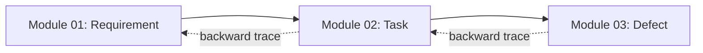

# Requirement Document — Module 02: Task Management

> **จัดทำโดย:** System Analyst (SA)
> **สถานะ:** Draft — รอ Review
> **Priority:** 🔴 MUST HAVE
> **ที่มา:** `aidlc/spaces/default/intents/260820-pm-tool-mvp/inception/requirements-analysis/requirements.md`, `docs/project-modules-overview.md`, `docs/team-roles-responsibilities.md`
> **ผู้อ่านเอกสารนี้:** SA, Dev, Tester (QA)
> **Scope:** express (Minimal depth) · **Stack:** React + Vite + TypeScript · **เก็บข้อมูล:** localStorage เท่านั้น

---

## 1. ภาพรวม (Overview)

### 1.1 วัตถุประสงค์

Module Task Management อยู่ตรงกลางของสายข้อมูล — รับ Requirement จากต้นน้ำมาแตกเป็นงานที่มอบหมายให้คนทำได้ พร้อมระบุ **ตำแหน่ง** ของผู้รับผิดชอบ (SA / UX / Dev / Tester) เพื่อให้เห็นภาระงานของแต่ละตำแหน่ง

```
Requirement → **Task** → Defect
```

### 1.2 Pain Point ที่ต้องแก้

เมื่อเกิด Defect ทีมมักถกเถียงว่า "ใครทำพลาด" — ตำแหน่งที่ระบุใน Task ช่วยให้เห็นว่างานไหนเป็นของใคร และ Defect ที่เกิดจาก Task นั้นอยู่ในความรับผิดชอบของตำแหน่งไหน

### 1.3 ตำแหน่งของโมดูลในสายข้อมูล



Task เป็นตัวกลาง — ต้นทางคือ Requirement ปลายทางคือ Defect ที่เกิดจากงานนั้น

**Text fallback:** Requirement → Task → Defect (Defect ย้อนถึง Task ถึง Requirement ได้)

### 1.4 ขอบเขตของรอบนี้ (MVP)

เป้าหมายรอบนี้คือ **CRUD + Traceability** — สร้าง Task ผูกกับ Requirement ได้ และเมื่อเกิด Defect สามารถย้อนมาถึง Task ได้

**สิ่งที่อยู่นอกขอบเขตรอบนี้ (Out of Scope):**
- Status workflow ของ Task (To Do → In Progress → Done)
- Estimate / Time tracking (Initial + Actual hours)
- Sprint assignment (ไม่มี entity Sprint)
- Work Pattern / Blocked By / Deadline Type / Delay Cause
- Drag-and-drop ย้ายการ์ดข้าม column
- Role-based access control (เช่น เฉพาะ PM เท่านั้นที่แตก Task ได้)
- Pagination
- Backend / REST API / Database

---

## 2. ผู้ใช้งานและบทบาท (Actors)

| Role | บทบาทใน Module นี้ |
|------|---------------------|
| **ทุกคน** | สร้าง แก้ไข ลบ Task ได้ (ไม่มีการจำกัดสิทธิ์) |
| **PM / SA** | ผู้ที่ควรเป็นคนแตก Task จาก Requirement โดยธรรมชาติ |
| **Dev / UX** | ผู้ที่มักถูกมอบหมายเป็น assignee |
| **Tester** | ดู Task เพื่ออ้างอิงเมื่อสร้าง Defect ใน Module 03 |

> **หมายเหตุ:** ไม่มีการจำกัดสิทธิ์ — ทุกคนทำได้ทุกอย่าง (ดูความเสี่ยง R1 ใน requirements)

---

## 3. Functional Requirements

### FR-01: สร้าง Task ผ่าน Web Form

**คำอธิบาย:** ผู้ใช้ต้องสามารถสร้าง Task ใหม่ผ่านฟอร์ม โดยต้องผูกกับ Requirement เสมอ

**Field ของ Task:**

| Field | ประเภทข้อมูล | บังคับ | คำอธิบาย |
|-------|--------------|--------|----------|
| id | String (UUID, auto-generated) | ✅ (auto) | รหัสอ้างอิงภายใน |
| Title | String | ✅ | หัวข้อของ Task |
| Description | Text | — | รายละเอียดเพิ่มเติม |
| Requirement ต้นทาง | Reference (Requirement ID) | ✅ | Task ต้องผูกกับ Requirement เสมอ (FR2.2) |
| ตำแหน่งผู้รับผิดชอบ | Enum: `SA` \| `UX` \| `Dev` \| `Tester` | ✅ | ตำแหน่งที่รับผิดชอบงานนี้ (FR2.3) |
| ผู้รับผิดชอบ | Reference (User ID) | ✅ | เลือกจาก dropdown (ค่าเริ่มต้น = ผู้ใช้ปัจจุบัน) |
| Created At | String (ISO date, auto) | ✅ (auto) | วันเวลาที่สร้าง |

**เกณฑ์การรับ (Acceptance Criteria):**

- Given ผู้ใช้กรอกฟอร์มครบทุก field บังคับและกดบันทึก, Then ระบบสร้าง Task ใหม่พร้อม UUID อัตโนมัติ และปรากฏในรายการทันที พร้อมผูกกับ Requirement ที่เลือก
- Given ผู้ใช้ยังไม่กรอก field บังคับ, When กดบันทึก, Then ระบบแสดง error ระบุ field ที่ขาดและไม่บันทึก

**อ้างอิง:** requirements.md FR2.1

---

### FR-02: Task ต้องผูกกับ Requirement เสมอ (ห้ามลอย)

**คำอธิบาย:** Task ทุกตัวต้องผูกกับ Requirement อย่างน้อย 1 ตัว เพื่อรักษาสาย traceability ไม่อนุญาตให้มี Task ที่ไม่มีต้นทาง

**เกณฑ์การรับ:**

- Given ผู้ใช้พยายามบันทึก Task โดยไม่เลือก Requirement, When กดบันทึก, Then ระบบปฏิเสธพร้อมข้อความ "ต้องเลือก Requirement ต้นทาง — Task ที่ไม่ผูกกับ Requirement ทำให้ตามรอยงานไม่ได้"
- Given ระบบยังไม่มี Requirement ใดเลย, When ผู้ใช้กดสร้าง Task ใหม่, Then ระบบแสดงข้อความแจ้ง "ยังสร้าง Task ไม่ได้ — ต้องมี Requirement ก่อน" พร้อมปุ่มกลับ (ไม่แสดงฟอร์ม)

**อ้างอิง:** requirements.md FR2.2

---

### FR-03: ระบุตำแหน่งผู้รับผิดชอบ

**คำอธิบาย:** Task ทุกตัวต้องระบุตำแหน่งของผู้รับผิดชอบเป็นค่าใดค่าหนึ่งใน 4 ค่า

| ค่า | ความหมาย |
|-----|----------|
| `SA` | System Analyst — งานวิเคราะห์/เขียนสเปค |
| `UX` | UX/UI Designer — งานออกแบบ |
| `Dev` | Developer — งานเขียนโค้ด |
| `Tester` | Tester (QA) — งานทดสอบ |

**เกณฑ์การรับ:**

- Given ผู้ใช้ไม่เลือกตำแหน่ง, When กดบันทึก, Then ระบบปฏิเสธพร้อมข้อความ "ต้องเลือกตำแหน่งเป็น SA, UX, Dev หรือ Tester"
- Given ผู้ใช้เลือกตำแหน่งเป็น Dev, When บันทึก, Then Task ปรากฏใน column "Dev" บน Board

**อ้างอิง:** requirements.md FR2.3

---

### FR-04: แสดงรายการและกรอง Task

**คำอธิบาย:** ระบบต้องแสดง Task ทั้งหมดในมุมมอง Board (จัดกลุ่มตามตำแหน่งผู้รับผิดชอบ) และ List view พร้อมตัวกรอง

**Board จัดกลุ่มตามตำแหน่ง:**

```
│  SA  │  UX  │  Dev  │  Tester  │
```

ทำให้เห็นได้ทันทีว่าตำแหน่งไหนมีภาระงานมากแค่ไหน

**ตัวกรองที่มี:**

| ตัวกรอง | ค่าที่เลือกได้ |
|---------|---------------|
| ตำแหน่ง | ทั้งหมด / SA / UX / Dev / Tester |
| ผู้รับผิดชอบ | ทั้งหมด / (รายชื่อ 12 คน) |
| Requirement ต้นทาง | ทั้งหมด / (รายชื่อ Requirement ที่มีในระบบ) |
| ข้อความค้นหา | ค้นหาใน title + description |

**เกณฑ์การรับ:**

- Given มี Task หลายตัว ตำแหน่งต่างกัน, When เลือก filter ตำแหน่ง = "Dev", Then แสดงเฉพาะ Task ที่ตำแหน่งเป็น Dev
- Given เลือก filter Requirement ต้นทาง = "REQ X", Then แสดงเฉพาะ Task ที่ผูกกับ Requirement นั้น
- Given พิมพ์คำค้นหา, Then แสดงเฉพาะ Task ที่มีคำนั้นใน title หรือ description

**อ้างอิง:** requirements.md FR2.4

---

### FR-05: แก้ไข Task

**คำอธิบาย:** ผู้ใช้ต้องสามารถแก้ไขทุก field ของ Task ที่มีอยู่ได้

**เกณฑ์การรับ:**

- Given Task มีอยู่แล้ว, When ผู้ใช้แก้ไขและบันทึก, Then ค่าใหม่ถูกเก็บและแสดงถูกต้องเมื่อเปิดดูอีกครั้ง
- Given ผู้ใช้แก้ไขแล้วเปลี่ยน Requirement ต้นทาง, When บันทึก, Then Task ย้ายไปอยู่ใต้ Requirement ใหม่ (traceability อัปเดตตาม)

**อ้างอิง:** requirements.md FR2.5

---

### FR-06: ลบ Task (Cascade Delete with Warning)

**คำอธิบาย:** ผู้ใช้ต้องสามารถลบ Task ได้ โดยระบบจะเตือนก่อนลบเสมอ และถ้ามี Defect ผูกอยู่จะบอกจำนวนที่จะถูกลบตาม

**เกณฑ์การรับ:**

- Given Task ไม่มี Defect ผูกอยู่, When กดลบ, Then ระบบแสดงคำถามยืนยัน "ลบ ... ใช่หรือไม่ การลบนี้กู้คืนไม่ได้"; ยืนยัน → หายจากรายการ; ยกเลิก → ยังอยู่
- Given Task มี Defect 3 ตัวผูกอยู่, When กดลบ, Then ระบบแสดง "มี 3 Defects ผูกอยู่ การลบจะลบ Defect เหล่านั้นตามไปด้วย และกู้คืนไม่ได้"
- Given ผู้ใช้ยืนยันการลบ cascade, When ระบบลบ, Then ลบ Task + Defect ทั้งหมดที่ผูกกับ Task นั้น

**อ้างอิง:** requirements.md FR2.5, FR4.5

---

### FR-07: แสดง Requirement ต้นทาง

**คำอธิบาย:** ผู้ใช้ต้องเห็นว่า Task แต่ละตัวมาจาก Requirement ไหน

**เกณฑ์การรับ:**

- Given Task ผูกกับ Requirement "X", When ดู card ของ Task บน Board, Then เห็นชื่อ Requirement "X" แสดงอยู่บน card
- Given Task ผูกกับ Requirement ที่ถูกลบไปแล้ว, When ดู card, Then แสดง "(Requirement ถูกลบแล้ว)" แทนชื่อ

> **หมายเหตุ:** กรณี Requirement ถูกลบโดย cascade (FR4.4 ของ Module 01) Task จะถูกลบตามด้วย จึงไม่เหลือ Task กำพร้า แต่กรณีข้อมูลเดิม (import มา) หรืออนาคตที่อาจมีทางลบ Requirement โดยไม่ cascade ระบบยังแสดงผลได้โดยไม่พัง

**อ้างอิง:** requirements.md FR2.6

---

### FR-08: แสดงจำนวน Defect ที่ผูกกับ Task

**คำอธิบาย:** ระบบต้องแสดงจำนวน Defect ที่เกิดจาก Task นั้นบน card และหน้ารายละเอียด

**เกณฑ์การรับ:**

- Given Task มี 3 Defect ผูกอยู่, When ดู card บน Board, Then เห็น "3 Defects"
- Given Task ไม่มี Defect เลย, When ดู card, Then เห็น "0 Defects"

**อ้างอิง:** requirements.md FR2.7

---

### FR-09: Traceability — Task เป็นจุดกลาง

**คำอธิบาย:** Task เป็นตัวเชื่อมระหว่าง Requirement (ต้นน้ำ) และ Defect (ปลายน้ำ) ต้องแสดงได้ทั้งสองทิศทาง

**เกณฑ์การรับ:**

- Given ดูหน้ารายละเอียด Task, Then เห็นชื่อ Requirement ต้นทาง
- Given ดูหน้ารายละเอียด Task ที่มี Defect, Then เห็นรายการ Defect ทั้งหมดที่ผูกอยู่ พร้อมประเภทและความรุนแรง
- Given ดูหน้า Defect (Module 03), Then เห็น Task ต้นทาง และ Requirement ต้นทาง (backward trace)

**อ้างอิง:** requirements.md FR4.1, FR4.2, FR4.5

---

## 4. Data Model (Implementation)

```typescript
// src/shared/types.ts

export const ROLES = ["SA", "UX", "Dev", "Tester"] as const;
export type Role = (typeof ROLES)[number];

export interface Task {
  id: string;            // UUID, auto-generated
  title: string;         // บังคับ, ห้ามว่าง
  description: string;   // ไม่บังคับ (ว่างได้)
  requirementId: string; // บังคับ, ห้ามว่าง — FK ไป Requirement.id
  assigneeId: string;    // บังคับ, reference ไป User
  role: Role;            // บังคับ, ต้องเป็น SA/UX/Dev/Tester
  createdAt: string;     // ISO date, auto
}
```

**Validation Rules (ใน repository layer):**

| กฎ | Error message |
|----|---------------|
| title ห้ามว่าง | "ต้องระบุหัวข้อของ Task" |
| requirementId ห้ามว่าง | "ต้องเลือก Requirement ต้นทาง — Task ที่ไม่ผูกกับ Requirement ทำให้ตามรอยงานไม่ได้" |
| role ต้องเป็นค่าใน ROLES | "ต้องเลือกตำแหน่งเป็น SA, UX, Dev หรือ Tester" |
| assigneeId ห้ามว่าง | "ต้องระบุผู้รับผิดชอบ" |

**สิ่งที่ไม่มีใน Data Model รอบนี้:**
- ❌ Status field — ไม่มี workflow (To Do → In Progress → Done)
- ❌ Sprint reference — entity Sprint ไม่มี
- ❌ Estimate / Actual hours — ไม่มี time tracking
- ❌ Work Pattern / Blocked By / Deadline Type — out of scope
- ❌ Audit log — ไม่มี

---

## 5. Architecture

### 5.1 Stack

เหมือน Module 01 — React + Vite + TypeScript, localStorage, ไม่มี backend

### 5.2 Repository

ใช้ `createRepository<Task>()` เหมือน pattern เดียวกับ Requirement:
- `list()` / `find(id)` / `create(draft)` / `update(id, changes)` / `remove(id)` / `removeWhere(predicate)`
- Validate ถูกเรียกทั้งตอน create และ update

### 5.3 Traceability Functions ที่เกี่ยวข้อง

| Function | หน้าที่ |
|----------|---------|
| `countDefectsForTask(taskId, defects)` | นับ Defect ที่ผูกกับ Task (FR2.7) |
| `countOrphansOnTaskDelete(taskId, defects)` | นับ Defect ที่จะถูกลบตามเมื่อลบ Task (FR4.5) |
| `traceForward(requirementId, tasks, defects)` | ใช้จากฝั่ง Requirement — คืน Tasks ที่ผูก |
| `traceBackward(defect, tasks, requirements)` | ใช้จากฝั่ง Defect — ย้อนถึง Task → Requirement |

---

## 6. Frontend — หน้าจอและ Component

### 6.1 Board View (หน้าหลัก)

Board จัดกลุ่มตาม **ตำแหน่งผู้รับผิดชอบ** (Role) — ทำให้เห็นภาระงานของแต่ละตำแหน่งทันที

```
┌─────────────────────────────────────────────────────────────────────┐
│  ✓ Tasks                                                            │
│  แตก Task จาก Requirement พร้อมระบุตำแหน่งผู้รับผิดชอบ                │
├─────────────────────────────────────────────────────────────────────┤
│  [🔍 ค้นหา...]  [ตำแหน่ง ▾]  [ผู้รับผิดชอบ ▾]  [Requirement ▾]    │
├─────────────────────────────────────────────────────────────────────┤
│  SA            │  UX           │  Dev           │  Tester          │
│ ┌────────────┐ │               │ ┌────────────┐ │ ┌────────────┐  │
│ │ เขียนสเปค  │ │               │ │ Login API   │ │ │ Test login  │  │
│ │ สมชาย (SA) │ │               │ │ กิตติ (Dev)  │ │ │ ศิริ (Test) │  │
│ │ ◎ Login..  │ │               │ │ ◎ Login..   │ │ │ ◎ Login..   │  │
│ │ 0 Defects  │ │               │ │ 2 Defects   │ │ │ 0 Defects   │  │
│ └────────────┘ │               │ └────────────┘ │ └────────────┘  │
└─────────────────────────────────────────────────────────────────────┘
```

**Card แสดง:**
- Title
- ชื่อผู้รับผิดชอบ
- ชื่อ Requirement ต้นทาง (◎ นำหน้า)
- จำนวน Defect ที่ผูกอยู่

### 6.2 ฟอร์มสร้าง/แก้ไข

```
┌─────────────────────────────────────────────────────────────────────┐
│  สร้าง Task / บันทึกการแก้ไข                                         │
├─────────────────────────────────────────────────────────────────────┤
│  หัวข้อ *                                                             │
│  [_____________________________________________]                    │
│                                                                       │
│  รายละเอียด                                                           │
│  [_____________________________________________]                    │
│                                                                       │
│  Requirement ต้นทาง *                                                 │
│  [— เลือก Requirement — ▾]                                          │
│  (hint: Task ที่ไม่ผูกกับ Requirement จะตามรอยงานไม่ได้)              │
│                                                                       │
│  ตำแหน่งผู้รับผิดชอบ *                                                 │
│  [— เลือกตำแหน่ง — ▾]   (SA / UX / Dev / Tester)                    │
│                                                                       │
│  ผู้รับผิดชอบ *                                                        │
│  [สมชาย (SA) ▾]                 ← ค่าเริ่มต้น = ผู้ใช้ปัจจุบัน       │
│                                                                       │
│                           [ยกเลิก]    [สร้าง Task]                   │
└─────────────────────────────────────────────────────────────────────┘
```

**กรณีพิเศษ: ไม่มี Requirement ในระบบ**

```
┌─────────────────────────────────────────────────────────────────────┐
│  ⚠ ยังสร้าง Task ไม่ได้                                              │
│                                                                       │
│  Task ทุกตัวต้องผูกกับ Requirement อย่างน้อย 1 ตัว                   │
│  ยังไม่มี Requirement ในระบบ กรุณาสร้าง Requirement ก่อน             │
│                                                                       │
│  [กลับ]                                                               │
└─────────────────────────────────────────────────────────────────────┘
```

**Behavior:**
- Requirement dropdown แสดง title + priority เช่น "Login ด้วยอีเมล (Must)"
- กดสร้าง Task จากปุ่ม + ใน column (เช่น column Dev) → ฟอร์มตั้งค่าตำแหน่งเป็น Dev ให้อัตโนมัติ
- ผู้รับผิดชอบตั้งต้นเป็นผู้ใช้ปัจจุบัน (FR5.2)

### 6.3 หน้า Detail

```
┌─────────────────────────────────────────────────────────────────────┐
│  [← กลับ]                              [แก้ไข]  [ลบ]               │
├─────────────────────────────────────────────────────────────────────┤
│  หัวข้อ:             Implement login API                             │
│  รายละเอียด:         สร้าง endpoint สำหรับยืนยันตัวตน                 │
│  ตำแหน่ง:            Dev                                             │
│  ผู้รับผิดชอบ:        กิตติ (Dev)                                      │
│  Requirement ต้นทาง: ผู้ใช้ต้องสามารถ login ได้                       │
│  สร้างเมื่อ:          20/8/2569 11:30:00                             │
│                                                                       │
│  ── Defects ที่พบใน Task นี้ (2) ──────────────────────────────────── │
│  • Password ไม่ hash · Code Bug · High                               │
│  • ไม่ validate email format · SA Gap · Medium                        │
└─────────────────────────────────────────────────────────────────────┘
```

---

## 7. Business Rules

1. **Task ห้ามลอย** — ต้องผูกกับ Requirement เสมอ ถ้าไม่มี Requirement ในระบบ จะสร้าง Task ไม่ได้
2. **ตำแหน่งบังคับ** — ต้องระบุตำแหน่ง (SA/UX/Dev/Tester) เพื่อจัดกลุ่มบน Board
3. **Cascade delete** — เมื่อลบ Task ที่มี Defect ผูกอยู่ ระบบลบ Defect ทั้งหมดตามไปด้วย (หลังผู้ใช้ยืนยัน)
4. **ไม่มีการจำกัดสิทธิ์** — ทุกคนสร้าง แก้ไข ลบได้หมด
5. **ค่าเริ่มต้น assignee** — ผู้ใช้ที่เลือกอยู่ใน dropdown ปัจจุบัน (FR5.2)
6. **ค่าเริ่มต้น role เมื่อกดเพิ่มจาก column** — ถ้ากดปุ่ม + ใน column "Dev" ตำแหน่งจะตั้งเป็น Dev อัตโนมัติ

---

## 8. ความเชื่อมโยงกับ Module อื่น

| Module | ความสัมพันธ์ |
|--------|-------------|
| **Module 01: Requirement** | Task ต้องผูกกับ Requirement (many-to-one) — ถ้า Requirement ถูกลบแบบ cascade Task จะถูกลบด้วย |
| **Module 03: Defect** | Defect ต้องผูกกับ Task (many-to-one) — ถ้า Task ถูกลบแบบ cascade Defect จะถูกลบด้วย |

**ทิศทางของสาย:**
```
Requirement (1) ← Task (N) ← Defect (N)
```

---

## 9. Non-Functional Requirements (ของโมดูลนี้เอง)

| ID | หมวด | Requirement | ตัวเลขเป้าหมาย | วิธีวัด |
|----|------|-------------|---------------|--------|
| NFR-01 | Performance | หน้า Board ต้องโหลดเร็ว | FCP ≤ 1.5 วินาที ที่ข้อมูล 100 Task | Chrome DevTools Lighthouse |
| NFR-02 | Responsiveness | การกรอง/ค้นหาต้องตอบสนองเร็ว | ≤ 200ms ที่ข้อมูลรวม 500 รายการ | Performance API |
| NFR-03 | Accessibility | หน้าจอเข้าถึงได้ | WCAG 2.1 AA, keyboard navigable | Lighthouse ≥ 90 |

---

## 10. Open Questions / Assumptions

### Assumptions

| ID | ข้อสันนิษฐาน | เหตุผล |
|----|-------------|-------|
| A1 | Task 1 ตัวผูกกับ Requirement ได้ 1 ตัวเท่านั้น (many-to-one) | Implementation ใช้ `requirementId` field เดียว |
| A2 | ตำแหน่ง (role) ไม่จำเป็นต้องตรงกับตำแหน่งของ user ที่เลือก | ผู้ใช้ u1 เป็น SA แต่สร้าง Task ที่ role = Dev ได้ |
| A3 | ไม่มี validation ว่า requirementId ชี้ไป Requirement ที่มีอยู่จริงใน storage | ระบบเชื่อค่าที่ส่งมาจาก dropdown — Requirement ที่ถูกลบจะทำให้ backward trace แสดง "(Requirement ถูกลบแล้ว)" |

### Open Questions

| ID | คำถาม | ต้องตอบก่อนถึงขั้นไหน |
|----|------|---------------------|
| OQ1 | รอบถัดไปควรเพิ่ม status workflow ก่อนหรือ estimate ก่อน | ก่อนวางแผนรอบถัดไป |
| OQ2 | ควรมี validation ว่า role ตรงกับตำแหน่งของ user ที่ assign ไหม (เช่น Task role=Dev ต้อง assign ให้คนที่เป็น Dev เท่านั้น) | ก่อนรอบถัดไป |

---

## 11. สิ่งที่ควรกลับมาทำในรอบถัดไป (Backlog)

เรียงตามลำดับความสำคัญที่แนะนำ:

| ลำดับ | Feature | เหตุผล |
|-------|---------|--------|
| 1 | Status workflow (To Do → In Progress → Review → Done) | จำเป็นเพื่อติดตามความคืบหน้าของ Task |
| 2 | Estimate / Time tracking | จำเป็นเพื่อวัด Estimate Variance ใน KPI |
| 3 | Sprint assignment | จำเป็นเมื่อเพิ่ม Sprint Management |
| 4 | Drag-and-drop ย้าย Task ข้าม column | UX improvement |
| 5 | Work Pattern / Blocked By / Delay Cause | จำเป็นเมื่อต้องวิเคราะห์สาเหตุที่งานล่าช้า |
| 6 | Validate role ตรงกับตำแหน่งจริงของ user | ป้องกันข้อมูลผิดพลาด |

---

## 12. เอกสารที่เกี่ยวข้อง

- `aidlc/spaces/default/intents/260820-pm-tool-mvp/inception/requirements-analysis/requirements.md` — Requirements specification ฉบับเต็ม (FR2 section)
- `docs/module-01-requirement-management.md` — Module ต้นน้ำที่ Task ต้องผูกกับ
- `docs/project-modules-overview.md` — ภาพรวม Modules (เอกสารต้นทาง)
- `docs/team-roles-responsibilities.md` — บทบาทและ KPI ของแต่ละ role (เอกสารต้นทาง)
- `README.md` — ข้อจำกัดของรุ่น MVP
