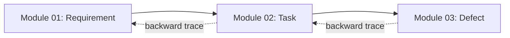

# Requirement Document — Module 03: Defect Tracking

> **จัดทำโดย:** System Analyst (SA)
> **สถานะ:** Draft — รอ Review
> **Priority:** 🔴 MUST HAVE
> **ที่มา:** `aidlc/spaces/default/intents/260820-pm-tool-mvp/inception/requirements-analysis/requirements.md`, `docs/project-modules-overview.md`, `docs/team-roles-responsibilities.md`
> **ผู้อ่านเอกสารนี้:** SA, Dev, Tester (QA)
> **Scope:** express (Minimal depth) · **Stack:** React + Vite + TypeScript · **เก็บข้อมูล:** localStorage เท่านั้น

---

## 1. ภาพรวม (Overview)

### 1.1 วัตถุประสงค์

Module Defect Tracking คือปลายทางของสายข้อมูล — เป็นที่บันทึกปัญหาที่พบ พร้อม **ระบุประเภท** เพื่อชี้ว่าต้นน้ำของปัญหาอยู่ที่ใคร:

```
Requirement → Task → **Defect (ระบุประเภท: ใครทำพลาด?)**
```

โมดูลนี้คือหัวใจของระบบ — ข้อมูลที่ว่า "Defect แต่ละประเภทมีกี่ตัว" คือสิ่งที่ทำให้ tool นี้ต่างจาก Trello หรือ Notion ทั่วไป

### 1.2 Pain Point ที่ต้องแก้

เมื่อเกิดปัญหา ทีมมักโยนให้ dev ทั้งหมด แต่ความจริงปัญหาอาจเกิดจาก:
- **SA** เขียนสเปคไม่ครบ (SA Gap)
- **UX** ออกแบบไม่ครอบ (Design Gap)
- **Dev** เขียนโค้ดผิด (Code Bug)
- **Tester** ปล่อยหลุด (Test Escape)
- **ระบบ** ไม่ผ่านเกณฑ์วัดผล (NFR Violation)

การแยก 5 ประเภทนี้ทำให้ **เห็นว่าต้องแก้ที่ไหน** ไม่ใช่แก้ที่ปลายทางเสมอ

### 1.3 ตำแหน่งของโมดูลในสายข้อมูล



Defect คือปลายน้ำ — เกิดจาก Task ที่แตกมาจาก Requirement ย้อนกลับได้ตลอดสาย

**Text fallback:** Requirement → Task → Defect (Defect ย้อนกลับถึง Task ถึง Requirement ได้)

### 1.4 ขอบเขตของรอบนี้ (MVP)

เป้าหมายรอบนี้คือ **CRUD + ระบุประเภท + Traceability** — สร้าง Defect ระบุประเภทได้ ย้อนถึงต้นน้ำได้ เห็นตัวเลขแยกตามประเภท

**สิ่งที่อยู่นอกขอบเขตรอบนี้ (Out of Scope):**
- Status workflow (Open → In Progress → Fixed → Closed)
- Evidence form บังคับ 3 ส่วน (อ้างอิง / ผลจริง / ผลกระทบ)
- Found In Stage (พบตอนไหนของ pipeline)
- Regression From (self-link กลับไป Defect ตัวเดิม)
- DoD enforcement (Critical/High ต้อง PM Acknowledge ก่อนปิด)
- Assignee field (มีแค่ reporter ไม่มี assignee)
- Resolution field
- NFR Metric auto-validation
- Backend / REST API / Database
- Role-based access control

---

## 2. ผู้ใช้งานและบทบาท (Actors)

| Role | บทบาทใน Module นี้ |
|------|---------------------|
| **ทุกคน** | สร้าง แก้ไข ลบ Defect ได้ (ไม่มีการจำกัดสิทธิ์) |
| **Tester** | ผู้ที่ควรเป็นคนรายงาน Defect โดยธรรมชาติของหน้าที่ |
| **Dev** | ดู Defect เพื่อรู้ว่าต้องแก้ที่ไหน อ้างอิงประเภทเพื่อตรวจว่าเป็น Code Bug จริงหรือเป็น SA Gap/Design Gap |
| **SA** | ดู Defect ประเภท SA Gap เพื่อปรับปรุงสเปค |

> **หมายเหตุ:** ไม่มีการจำกัดสิทธิ์ — ทุกคนทำได้ทุกอย่าง (ดูความเสี่ยง R1 ใน requirements)

---

## 3. Functional Requirements

### FR-01: สร้าง Defect ผ่าน Web Form

**คำอธิบาย:** ผู้ใช้ต้องสามารถสร้าง Defect ใหม่ผ่านฟอร์ม โดยต้องผูกกับ Task และระบุประเภทเสมอ

**Field ของ Defect:**

| Field | ประเภทข้อมูล | บังคับ | คำอธิบาย |
|-------|--------------|--------|----------|
| id | String (UUID, auto-generated) | ✅ (auto) | รหัสอ้างอิงภายใน |
| Title | String | ✅ | หัวข้อสั้นของ Defect |
| Description | Text | — | รายละเอียด (แนะนำให้ระบุขั้นตอนทำซ้ำ + ผลคาดหวัง vs ผลจริง) |
| Task ต้นทาง | Reference (Task ID) | ✅ | Defect ต้องผูกกับ Task เสมอ (FR3.4) |
| ประเภท | Enum: 5 ค่า (ดู FR-02) | ✅ | ชี้ว่าต้นน้ำของปัญหาอยู่ที่ใด (FR3.2) |
| ความรุนแรง | Enum: `Critical` \| `High` \| `Medium` \| `Low` | ✅ | ระดับความรุนแรง (FR3.3) |
| ผู้รายงาน | Reference (User ID) | ✅ | เลือกจาก dropdown (ค่าเริ่มต้น = ผู้ใช้ปัจจุบัน) |
| Created At | String (ISO date, auto) | ✅ (auto) | วันเวลาที่รายงาน |

**เกณฑ์การรับ (Acceptance Criteria):**

- Given ผู้ใช้กรอกฟอร์มครบทุก field บังคับ, When กดบันทึก, Then ระบบสร้าง Defect ใหม่และปรากฏในรายการทันที ผูกกับ Task ที่เลือก
- Given ผู้ใช้ยังไม่กรอก field บังคับ, When กดบันทึก, Then ระบบแสดง error ระบุ field ที่ขาดและไม่บันทึก

**อ้างอิง:** requirements.md FR3.1

---

### FR-02: ประเภท Defect — 5 ค่า (ระบุต้นน้ำของปัญหา)

**คำอธิบาย:** Defect ทุกตัวต้องระบุประเภทเป็นค่าใดค่าหนึ่งใน 5 ค่า เพื่อชี้ว่า "ใครควรแก้" ไม่ใช่ "ใครทำ"

| ค่า | ต้นน้ำของปัญหา | ตัวอย่าง |
|-----|----------------|----------|
| `Code Bug` | โค้ดทำไม่ตรงกับที่สเปคและ design ระบุไว้ | API return 500 เมื่อ input ถูกต้อง |
| `SA Gap` | สเปคไม่ครบ ไม่ชัด หรือขัดแย้งกันเอง | ไม่ได้ระบุว่าจะจัดการอย่างไรเมื่อ email ซ้ำ |
| `Design Gap` | design ไม่ครอบกรณีนี้ | ไม่ได้ออกแบบหน้าจอสำหรับกรณีข้อมูลว่าง |
| `Test Escape` | ปัญหาที่ควรเจอตอนทดสอบ แต่หลุดไป | bug ที่ user พบใน production ทั้งที่มี test case ครอบอยู่ |
| `NFR Violation` | ทำงานถูกแต่ไม่ผ่านเกณฑ์ที่วัดได้ | หน้า Dashboard โหลด 5 วินาที ทั้งที่กำหนดไว้ 2 วินาที |

**เหตุผลที่แยก 5 ประเภท:** ถ้า SA Gap สูง แปลว่าต้องแก้ที่การเขียนสเปค ไม่ใช่โทษคนเขียนโค้ด ถ้า Test Escape สูง แปลว่าต้องปรับ test strategy

**เกณฑ์การรับ:**

- Given ผู้ใช้ไม่เลือกประเภท, When กดบันทึก, Then ระบบปฏิเสธพร้อมข้อความ "ต้องเลือกประเภทเป็น Code Bug, SA Gap, Design Gap, Test Escape หรือ NFR Violation"
- Given ผู้ใช้เลือกประเภท, When ฟอร์มแสดงผล, Then แสดง hint อธิบายความหมายของประเภทนั้น (เช่น เลือก "SA Gap" → hint แสดง "สเปคไม่ครบ ไม่ชัด หรือขัดแย้งกันเอง")

**อ้างอิง:** requirements.md FR3.2

---

### FR-03: ความรุนแรง (Severity)

**คำอธิบาย:** Defect ทุกตัวต้องระบุความรุนแรง เพื่อจัดลำดับการแก้ไข

| ค่า | ความหมาย |
|-----|----------|
| `Critical` | ระบบใช้งานไม่ได้ / ข้อมูลเสียหาย / กระทบผู้ใช้ทั้งหมด |
| `High` | ฟีเจอร์หลักใช้งานไม่ได้ แต่มี workaround |
| `Medium` | ฟีเจอร์รองมีปัญหา / UX ไม่ดีแต่ทำงานได้ |
| `Low` | ปัญหาเล็กน้อย / cosmetic |

**เกณฑ์การรับ:**

- Given ผู้ใช้ไม่เลือกความรุนแรง, When กดบันทึก, Then ระบบปฏิเสธพร้อมข้อความ "ต้องเลือกความรุนแรงเป็น Critical, High, Medium หรือ Low"
- Given Defect มีความรุนแรง Critical, When ดูบน Board, Then เห็น badge สีที่แตกต่างจากระดับอื่น

**อ้างอิง:** requirements.md FR3.3

---

### FR-04: Defect ต้องผูกกับ Task เสมอ (ห้ามลอย)

**คำอธิบาย:** Defect ทุกตัวต้องผูกกับ Task เพื่อรักษาสาย traceability กลับถึง Requirement ต้นทาง

**เกณฑ์การรับ:**

- Given ผู้ใช้พยายามบันทึก Defect โดยไม่เลือก Task, When กดบันทึก, Then ระบบปฏิเสธพร้อมข้อความ "ต้องเลือก Task ต้นทาง — Defect ที่ไม่ผูกกับ Task ทำให้ย้อนหาต้นเหตุไม่ได้"
- Given ระบบยังไม่มี Task ใดเลย, When ผู้ใช้กดสร้าง Defect, Then ระบบแสดงข้อความ "ยังสร้าง Defect ไม่ได้ — ต้องมี Task ก่อน" พร้อมปุ่มกลับ (ไม่แสดงฟอร์ม)

**อ้างอิง:** requirements.md FR3.4

---

### FR-05: แสดงรายการและกรอง Defect

**คำอธิบาย:** ระบบต้องแสดง Defect ทั้งหมดในมุมมอง Board (จัดกลุ่มตามประเภท 5 columns) และ List view พร้อมตัวกรอง

**Board จัดกลุ่มตามประเภท (5 columns):**

```
│ Code Bug │ SA Gap │ Design Gap │ Test Escape │ NFR Violation │
```

ตัวเลขบนหัว column = จำนวน Defect ของแต่ละประเภท (FR3.7) ทำให้เห็นทันทีว่าปัญหากระจุกที่ต้นน้ำไหน

**ตัวกรองที่มี:**

| ตัวกรอง | ค่าที่เลือกได้ |
|---------|---------------|
| ประเภท | ทั้งหมด / Code Bug / SA Gap / Design Gap / Test Escape / NFR Violation |
| ความรุนแรง | ทั้งหมด / Critical / High / Medium / Low |
| ข้อความค้นหา | ค้นหาใน title + description |

**เกณฑ์การรับ:**

- Given มี Defect หลายตัว ประเภทต่างกัน, When ดูมุมมอง Board, Then เห็น 5 columns ครบทุกประเภท แม้บาง column ไม่มี Defect (แสดง column ว่าง ไม่ซ่อน)
- Given เลือก filter ประเภท = "SA Gap", Then แสดงเฉพาะ Defect ที่เป็น SA Gap
- Given เลือก filter ความรุนแรง = "Critical", Then แสดงเฉพาะ Critical ทุกประเภท

**อ้างอิง:** requirements.md FR3.5, FR3.7

---

### FR-06: แก้ไขและลบ Defect

**คำอธิบาย:** ผู้ใช้ต้องสามารถแก้ไขทุก field ของ Defect ได้ และลบ Defect ได้ (ไม่มี cascade เพราะ Defect เป็น leaf node ไม่มีอะไรผูกต่อ)

**เกณฑ์การรับ:**

- Given Defect มีอยู่แล้ว, When ผู้ใช้แก้ไขและบันทึก, Then ค่าใหม่ถูกเก็บและแสดงถูกต้อง
- Given กดลบ Defect, When ระบบแสดงคำถามยืนยัน "ลบ ... ใช่หรือไม่ การลบนี้กู้คืนไม่ได้", Then ยืนยัน → หายจากรายการ; ยกเลิก → ยังอยู่

> **หมายเหตุ:** Defect เป็นปลายสุดของสาย (leaf node) ไม่มี entity อื่นผูกต่อ จึง **ไม่มี cascade** — ลบได้ทันทีโดยไม่กระทบข้อมูลอื่น

**อ้างอิง:** requirements.md FR3.6

---

### FR-07: จำนวน Defect แยกตามประเภท

**คำอธิบาย:** ระบบต้องแสดงจำนวน Defect แยกตามประเภททั้ง 5 ให้เห็นได้ทันทีบนหน้า Board

**เกณฑ์การรับ:**

- Given มี 2 Code Bug, 1 SA Gap, 0 Design Gap, 0 Test Escape, 0 NFR Violation, When ดูหน้า Board, Then แต่ละ column header แสดงจำนวน: Code Bug (2), SA Gap (1), Design Gap (0), Test Escape (0), NFR Violation (0)
- Given เพิ่ม Defect ใหม่ประเภท SA Gap, When กลับดู Board, Then ตัวเลขบน column SA Gap เพิ่มเป็น 2

**อ้างอิง:** requirements.md FR3.7

---

### FR-08: Backward Trace — Defect → Task → Requirement

**คำอธิบาย:** ระบบต้องแสดงเส้นทางย้อนกลับจาก Defect ขึ้นไปถึง Task และ Requirement ต้นทาง

**เกณฑ์การรับ:**

- Given Defect ผูกกับ Task "X" ซึ่งผูกกับ Requirement "Y", When ดูหน้ารายละเอียด Defect, Then เห็นข้อมูล:
  - Task: "X" · ตำแหน่ง · ผู้รับผิดชอบ
  - Requirement: "Y" · ระดับความสำคัญ
- Given Defect ผูกกับ Task ที่ถูกลบไปแล้ว (orphan), When ดูหน้ารายละเอียด, Then แสดง "(Task ถูกลบแล้ว — Defect นี้กำพร้า)" แทนที่จะ error หรือจอขาว
- Given ดู card บน Board, When card แสดงผล, Then เห็นชื่อ Task ต้นทางบน card (✓ นำหน้า)

**อ้างอิง:** requirements.md FR4.2

---

## 4. Data Model (Implementation)

```typescript
// src/shared/types.ts

export const DEFECT_TYPES = [
  "Code Bug",
  "SA Gap",
  "Design Gap",
  "Test Escape",
  "NFR Violation",
] as const;
export type DefectType = (typeof DEFECT_TYPES)[number];

export const SEVERITIES = ["Critical", "High", "Medium", "Low"] as const;
export type Severity = (typeof SEVERITIES)[number];

export interface Defect {
  id: string;          // UUID, auto-generated
  title: string;       // บังคับ, ห้ามว่าง
  description: string; // ไม่บังคับ (ว่างได้)
  taskId: string;      // บังคับ, ห้ามว่าง — FK ไป Task.id
  type: DefectType;    // บังคับ, ต้องเป็น 1 ใน 5 ค่า
  severity: Severity;  // บังคับ, ต้องเป็น Critical/High/Medium/Low
  reporterId: string;  // บังคับ, reference ไป User
  createdAt: string;   // ISO date, auto
}
```

**Validation Rules (ใน repository layer):**

| กฎ | Error message |
|----|---------------|
| title ห้ามว่าง | "ต้องระบุหัวข้อของ Defect" |
| taskId ห้ามว่าง | "ต้องเลือก Task ต้นทาง — Defect ที่ไม่ผูกกับ Task ทำให้ย้อนหาต้นเหตุไม่ได้" |
| type ต้องเป็น 1 ใน 5 ค่า | "ต้องเลือกประเภทเป็น Code Bug, SA Gap, Design Gap, Test Escape หรือ NFR Violation" |
| severity ต้องเป็น 1 ใน 4 ค่า | "ต้องเลือกความรุนแรงเป็น Critical, High, Medium หรือ Low" |
| reporterId ห้ามว่าง | "ต้องระบุผู้รายงาน" |

**สิ่งที่ไม่มีใน Data Model รอบนี้:**
- ❌ Status field — ไม่มี workflow (Open → Fixed → Closed)
- ❌ Evidence fields (reference/actual/impact)
- ❌ Found In Stage
- ❌ Regression From (self-link)
- ❌ Assignee field — มีแค่ reporter
- ❌ Resolution / Root Cause field
- ❌ Audit log

---

## 5. Architecture

### 5.1 Stack

เหมือน Module 01 และ 02 — React + Vite + TypeScript, localStorage, ไม่มี backend

### 5.2 Repository

ใช้ `createRepository<Defect>()` เหมือน pattern เดียวกับ Module อื่น:
- `list()` / `find(id)` / `create(draft)` / `update(id, changes)` / `remove(id)` / `removeWhere(predicate)`
- Validate ถูกเรียกทั้งตอน create และ update
- `removeWhere` ถูกเรียกจาก Module อื่น (Task cascade delete ลบ Defect ที่ผูก)

### 5.3 Traceability Functions ที่เกี่ยวข้อง

| Function | หน้าที่ |
|----------|---------|
| `traceBackward(defect, tasks, requirements)` | คืน Task + Requirement ต้นทางของ Defect (FR4.2) |
| `countDefectsByType(defects)` | นับ Defect แยกตามประเภททั้ง 5 (FR3.7) |
| `countDefectsForTask(taskId, defects)` | นับ Defect ที่ผูกกับ Task (ใช้จากฝั่ง Task) |

---

## 6. Frontend — หน้าจอและ Component

### 6.1 Board View (หน้าหลัก)

Board จัดกลุ่มตาม **ประเภท Defect** (5 columns) — ตัวเลขบนหัว column คือคำตอบของ "ปัญหากระจุกที่ต้นน้ำไหน"

```
┌───────────────────────────────────────────────────────────────────────────┐
│  ◆ Defects                                                                │
│  บันทึก Defect พร้อมระบุประเภทเพื่อชี้ต้นน้ำของปัญหา                       │
├───────────────────────────────────────────────────────────────────────────┤
│  [🔍 ค้นหา...]  [ประเภท ▾]  [ความรุนแรง ▾]                              │
├───────────────────────────────────────────────────────────────────────────┤
│  Code Bug (2) │ SA Gap (3) │ Design Gap (0) │ Test Escape (1) │ NFR.. (0)│
│ ┌───────────┐ │┌──────────┐│                │ ┌───────────┐   │          │
│ │ API error  │ ││ ไม่ระบุ   ││                │ │ Login bug  │   │          │
│ │ ■ Critical │ ││ case empty││                │ │ ■ Medium   │   │          │
│ │ ธนา (Test) │ ││ ■ High    ││                │ │ มาลี (Test)│   │          │
│ │ ✓ Login API│ ││ ■ ศิริ    ││                │ │ ✓ Test UI  │   │          │
│ └───────────┘ │└──────────┘│                │ └───────────┘   │          │
│ ┌───────────┐ │┌──────────┐│                │                 │          │
│ │ Null crash │ ││ NFR ไม่   ││                │                 │          │
│ │ ■ High     │ ││ ชัด       ││                │                 │          │
│ │ ศิริ (Test)│ ││ ■ Medium  ││                │                 │          │
│ │ ✓ Form UI  │ ││ ✓ Perf ..││                │                 │          │
│ └───────────┘ │└──────────┘│                │                 │          │
└───────────────────────────────────────────────────────────────────────────┘
```

**Card แสดง:**
- Title
- Severity badge (สี แตกต่างตามระดับ)
- ชื่อผู้รายงาน
- ชื่อ Task ต้นทาง (✓ นำหน้า)

### 6.2 ฟอร์มสร้าง/แก้ไข

```
┌─────────────────────────────────────────────────────────────────────┐
│  สร้าง Defect / บันทึกการแก้ไข                                       │
├─────────────────────────────────────────────────────────────────────┤
│  หัวข้อ *                                                             │
│  [_____________________________________________]                    │
│                                                                       │
│  รายละเอียด                                                           │
│  (hint: ระบุขั้นตอนที่ทำให้เกิดซ้ำได้ และผลที่คาดหวังเทียบกับผลจริง) │
│  [_____________________________________________]                    │
│  [_____________________________________________]                    │
│                                                                       │
│  Task ต้นทาง *                                                        │
│  [— เลือก Task — ▾]                                                 │
│  (hint: Defect ที่ไม่ผูกกับ Task จะย้อนหาต้นเหตุไม่ได้)              │
│  (dropdown แสดง: task title + (role · requirement title))            │
│                                                                       │
│  ประเภท *                                                             │
│  [— เลือกประเภท — ▾]                                                │
│  (hint: เปลี่ยนตามค่าที่เลือก เช่น "สเปคไม่ครบ ไม่ชัด...")          │
│                                                                       │
│  ความรุนแรง *                                                         │
│  [— เลือกความรุนแรง — ▾]   (Critical / High / Medium / Low)         │
│                                                                       │
│  ผู้รายงาน *                                                           │
│  [ธนา (Tester) ▾]              ← ค่าเริ่มต้น = ผู้ใช้ปัจจุบัน       │
│                                                                       │
│                           [ยกเลิก]    [สร้าง Defect]                 │
└─────────────────────────────────────────────────────────────────────┘
```

**กรณีพิเศษ: ไม่มี Task ในระบบ**

```
┌─────────────────────────────────────────────────────────────────────┐
│  ⚠ ยังสร้าง Defect ไม่ได้                                            │
│                                                                       │
│  Defect ทุกตัวต้องผูกกับ Task อย่างน้อย 1 ตัว                        │
│  ยังไม่มี Task ในระบบ กรุณาสร้าง Task ก่อน                            │
│                                                                       │
│  [กลับ]                                                               │
└─────────────────────────────────────────────────────────────────────┘
```

**Behavior:**
- Task dropdown แสดง: `task title (role · requirement title)` — เพื่อให้เห็น context ว่า Task นั้นมาจาก Requirement ไหนและเป็นงานของตำแหน่งใด
- Type dropdown มี dynamic hint ที่เปลี่ยนตามค่าที่เลือก (TYPE_HINTS)
- กดสร้าง Defect จากปุ่ม + ใน column (เช่น column "SA Gap") → ฟอร์มตั้งประเภทเป็น SA Gap ให้อัตโนมัติ
- ผู้รายงานตั้งต้นเป็นผู้ใช้ปัจจุบัน (FR5.2)

### 6.3 หน้า Detail

```
┌─────────────────────────────────────────────────────────────────────┐
│  [← กลับ]                              [แก้ไข]  [ลบ]               │
├─────────────────────────────────────────────────────────────────────┤
│  หัวข้อ:          API return 500 เมื่อ email ว่าง                    │
│  รายละเอียด:      กด login โดยไม่กรอก email → server error          │
│  ประเภท:          Code Bug                                          │
│  ความรุนแรง:      Critical                                           │
│  ผู้รายงาน:        ธนา (Tester)                                       │
│  รายงานเมื่อ:      20/8/2569 14:00:00                               │
│                                                                       │
│  ── สายย้อนกลับถึงต้นทาง ──────────────────────────────────────────  │
│  • Task: Implement login API · Dev · กิตติ (Dev)                     │
│  • Requirement: ผู้ใช้ต้อง login ได้ · Must                           │
└─────────────────────────────────────────────────────────────────────┘
```

---

## 7. Business Rules

1. **Defect ห้ามลอย** — ต้องผูกกับ Task เสมอ ถ้าไม่มี Task ในระบบ จะสร้าง Defect ไม่ได้
2. **ประเภทบังคับ** — ต้องเลือก 1 ใน 5 ค่า เพื่อระบุต้นน้ำของปัญหา
3. **ความรุนแรงบังคับ** — ต้องเลือก Critical/High/Medium/Low
4. **ไม่มี cascade เมื่อลบ Defect** — Defect เป็น leaf node ลบได้เลยไม่กระทบอะไร
5. **Defect ถูกลบ cascade จากต้นน้ำ** — เมื่อ Task ถูกลบ (FR4.5 Module 02) Defect ที่ผูกจะถูกลบตามไปด้วย
6. **ไม่มีการจำกัดสิทธิ์** — ทุกคนสร้าง แก้ไข ลบได้หมด
7. **ค่าเริ่มต้น reporter** — ผู้ใช้ที่เลือกอยู่ใน dropdown ปัจจุบัน (FR5.2)
8. **ค่าเริ่มต้น type เมื่อกดเพิ่มจาก column** — ถ้ากดปุ่ม + ใน column "SA Gap" ประเภทจะตั้งเป็น SA Gap อัตโนมัติ

---

## 8. ความเชื่อมโยงกับ Module อื่น

| Module | ความสัมพันธ์ |
|--------|-------------|
| **Module 01: Requirement** | Defect ย้อนถึง Requirement ผ่าน Task (backward trace) — ประเภท `SA Gap` สะท้อนว่า Requirement เขียนไม่ครบ |
| **Module 02: Task** | Defect ต้องผูกกับ Task (many-to-one) — ถ้า Task ถูกลบแบบ cascade Defect จะถูกลบด้วย |

**ทิศทางของสาย:**
```
Requirement (1) ← Task (N) ← Defect (N)
                              ↑ leaf node — ไม่มีอะไรผูกต่อ
```

---

## 9. Non-Functional Requirements (ของโมดูลนี้เอง)

| ID | หมวด | Requirement | ตัวเลขเป้าหมาย | วิธีวัด |
|----|------|-------------|---------------|--------|
| NFR-01 | Performance | หน้า Board (5 columns) ต้องโหลดเร็ว | FCP ≤ 1.5 วินาที ที่ข้อมูล 100 Defect | Chrome DevTools Lighthouse |
| NFR-02 | Responsiveness | การกรอง/ค้นหาต้องตอบสนองเร็ว | ≤ 200ms ที่ข้อมูลรวม 500 รายการ | Performance API |
| NFR-03 | Accessibility | หน้าจอเข้าถึงได้ | WCAG 2.1 AA, keyboard navigable | Lighthouse ≥ 90 |
| NFR-04 | Visibility | Board ต้องแสดง column ครบ 5 ประเภทเสมอ | 0 กรณีที่ column หายเมื่อไม่มี defect ในประเภทนั้น | ทดสอบด้วยมือ |

---

## 10. Open Questions / Assumptions

### Assumptions

| ID | ข้อสันนิษฐาน | เหตุผล |
|----|-------------|-------|
| A1 | Defect 1 ตัวผูกกับ Task ได้ 1 ตัวเท่านั้น (many-to-one) | Implementation ใช้ `taskId` field เดียว |
| A2 | ไม่มี validation ว่า taskId ชี้ไป Task ที่มีจริง | ระบบเชื่อค่าจาก dropdown — Task ที่ถูกลบจะทำให้ backward trace แสดง "(Task ถูกลบแล้ว)" |
| A3 | ผู้รายงาน (reporter) ≠ ผู้แก้ไข (assignee) — รอบนี้มีแค่ reporter | ยังไม่มี workflow จึงไม่ต้องระบุว่าใครรับไปแก้ |

### Open Questions

| ID | คำถาม | ต้องตอบก่อนถึงขั้นไหน |
|----|------|---------------------|
| OQ1 | Evidence form 3 ส่วน (อ้างอิง/ผลจริง/ผลกระทบ) ควรกลับมาทำเป็นลำดับแรกไหม (เพราะเป็นคุณค่าหลัก) | ก่อนวางแผนรอบถัดไป |
| OQ2 | เมื่อเพิ่ม status workflow ควรบังคับ PM Acknowledge ก่อนปิด Critical/High ไหม | ก่อนออกแบบ workflow |
| OQ3 | ควรเพิ่ม "Found In Stage" เพื่อวัด Test Escape Rate ที่แม่นยำขึ้นไหม | ก่อนรอบ KPI Dashboard |

---

## 11. สิ่งที่ควรกลับมาทำในรอบถัดไป (Backlog)

เรียงตามลำดับความสำคัญที่แนะนำ:

| ลำดับ | Feature | เหตุผล |
|-------|---------|--------|
| 1 | Evidence form บังคับ 3 ส่วน (อ้างอิง/ผลจริง/ผลกระทบ) | เป็นคุณค่าหลัก — ทำให้ Defect มีหลักฐานอ้างอิงได้ ลดข้อถกเถียง |
| 2 | Status workflow (Open → In Progress → Fixed → Verified → Closed) | จำเป็นเพื่อติดตามว่า Defect แต่ละตัวถูกจัดการหรือยัง |
| 3 | Assignee field (แยกจาก Reporter) | ต้องรู้ว่าใครรับไปแก้ |
| 4 | DoD enforcement (Critical/High ต้อง PM Acknowledge) | ป้องกันปิด Defect รุนแรงโดยไม่ผ่านการตรวจ |
| 5 | Found In Stage tracking | วัด Test Escape Rate ที่แม่นยำ |
| 6 | NFR Metric auto-validation (เทียบค่าจริง vs ค่าที่กำหนดใน Requirement) | จำเป็นเมื่อ Module 01 เพิ่ม NFR Metric validation |
| 7 | Regression From (self-link) | ติดตาม Defect ที่กลับมาซ้ำ |

---

## 12. เอกสารที่เกี่ยวข้อง

- `aidlc/spaces/default/intents/260820-pm-tool-mvp/inception/requirements-analysis/requirements.md` — Requirements specification ฉบับเต็ม (FR3 section)
- `docs/module-01-requirement-management.md` — Module ต้นน้ำสุด (Requirement)
- `docs/module-02-task-management.md` — Module กลาง (Task) ที่ Defect ต้องผูกกับ
- `docs/project-modules-overview.md` — ภาพรวม Modules (เอกสารต้นทาง)
- `docs/team-roles-responsibilities.md` — บทบาทและ KPI ของแต่ละ role (เอกสารต้นทาง)
- `README.md` — ข้อจำกัดของรุ่น MVP
